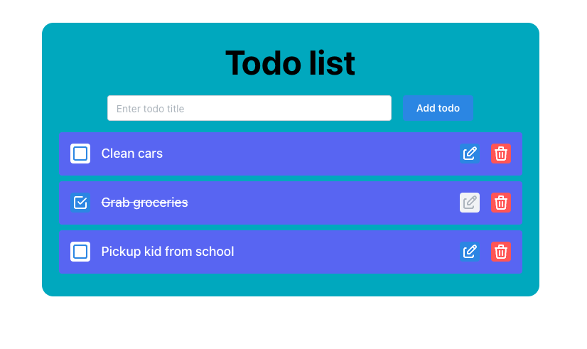

# TODO UI App for Chemify technical assessment

Simple Todo app with add, update, delete operations.

## How To Use

This app uses Yarn, so please istall yarn

`npm install --global yarn`

Install the app:

`yarn install`

Start the app:

`yarn start`

it shuld run the app on `[http://localhost:3000](http://localhost:3000)`

## Things to improve:

- Add unit tests
- Implement 'dark mode'
- Use more mantine theme and UI options as i have limited knowledge in it so used few mantine features. Currently i'm learning it and finding it more interesting.
